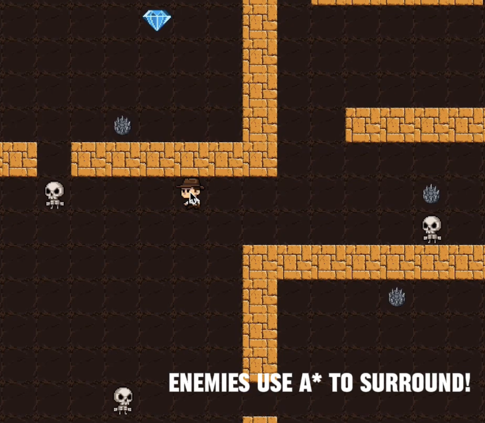

Java based 2D Game
Group Project for CMPT 276 Intro to Software Engineering

**Tech Stack:** 
- Java
- Mave
- javaFX

## Team Members
* Lex Camplin
* Sydney Komanac
* Diar Shakimov
* John Araujo

## run the game
1. Clone the repository
2. Navigate to the project directory
3. Build the project: `mvn compile`
4. Run the game: `mvn exec:java -Dexec.mainClass="game.core.Main"`

## Features

- Adventure gameplay
- Entity-based architecture
- Modular design for easy extension
- Reward system

## Development
This project follows standard Java development practices with separation of concerns across different packages for maintainability and scalability.

